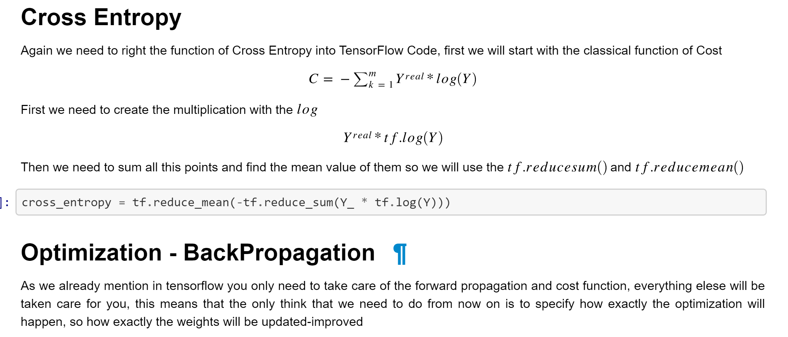

# Neural Network with TensorFlow

Using TensorFlow framework to create a simple Neural Network as an introduction to the field - Originally developed 08/03/2019

## What was developed in this project
In this project we are going a step further by using a framework and more specifically TensorFlow to develop the Neural Network. You can find the actual project on the Jupyter Notebook.

